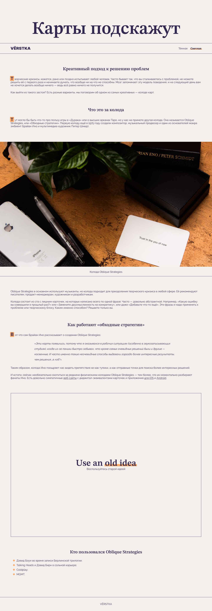
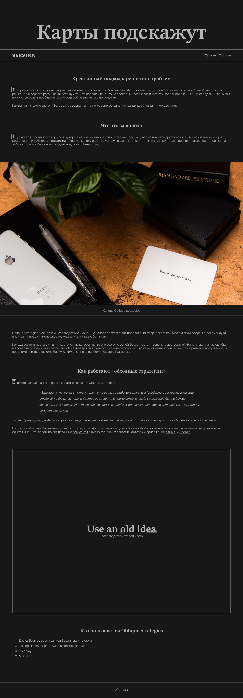
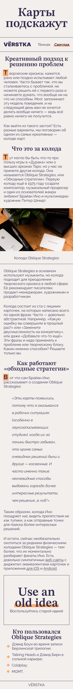
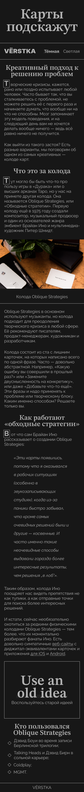
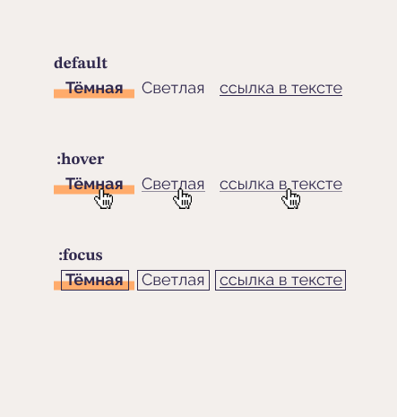
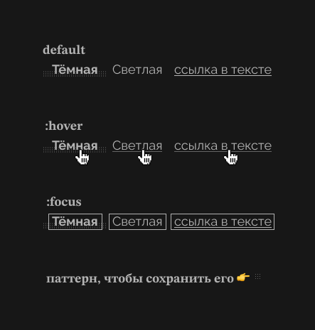

# karty-podskazhut

### Описание
3.1 Адаптивная верстка базовой веб-страницы по макету с использованием пременных и состояний.

### Стек:
- HTML и CSS

[Ссылка на макет](https://www.figma.com/file/GWuqAvaONsjQPXz53n9d0L/%235-%D0%9A%D0%B0%D1%80%D1%82%D1%8B-%D0%BF%D0%BE%D0%B4%D1%81%D0%BA%D0%B0%D0%B6%D1%83%D1%82/duplicate)

